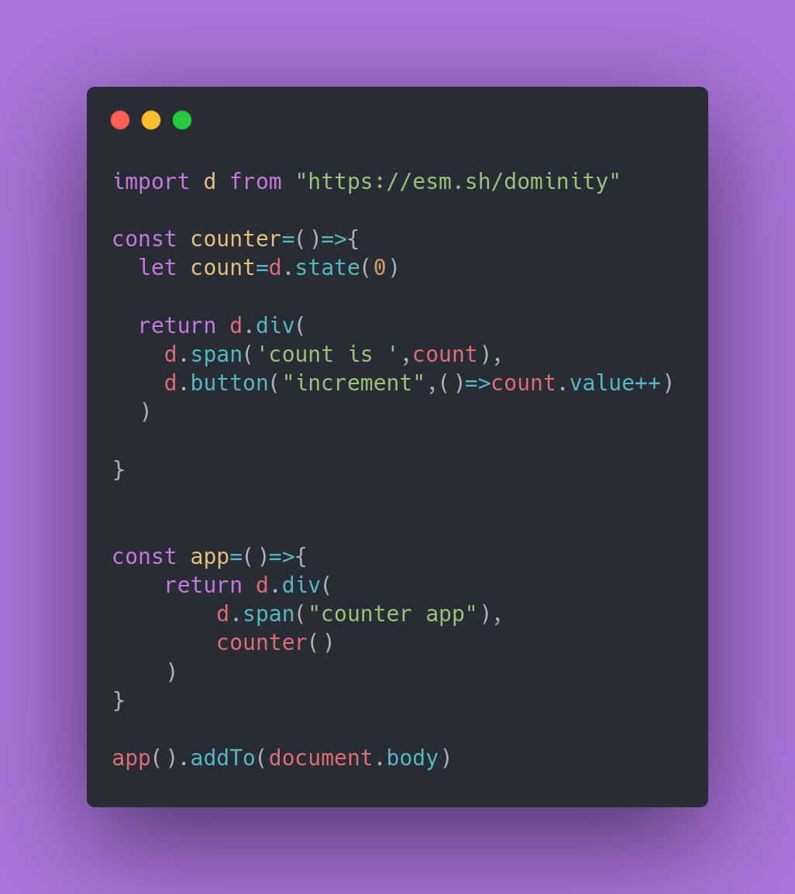

## Dominity js


[](https://www.npmjs.com/package/dominity) &nbsp;
[](https://www.npmjs.com/package/dominity) &nbsp;

dominity is a minimalist frontend framework to make data heavy single page applications(SPA) which feels snappy and fast. It is performant and lightweight and needs no build step making development of SPA's effortless 

dominity has everything what you need from a  powerful clientside router to a state Mangement solution.
and as cherry on top many plugins to extend its functionality formvalidation , tables and more 

## features
- simple and intutive api 
- you dont need a buildstep
- lightweight
- reactive with signals
- no virtual dom
- no uncecessary naming conventions
- builtin clientside routing 
- builtin state management


[view docs](https://dominity.vercel.app)
 

```js
import {button,state,derived} from "dominity"

function counter() {
  const count = state(0);
  const doubleCount = derived(() => count.value * 2);
  

  return button("count is :",doubleCount).on("click",()=>{
    count.value++
  })
}

Counter().addTo(document.body);
```

## getting started

use directly via cdn or install form npm 
```js
import d from "https://esm.sh/dominity
```
or 
```bash
npm i dominity
```
recommened to use vite with dominity 

## building ui with dominity 
instead of making html tags , dominity provides functions to create elements , functions are more flexible as they can be rerun multiple times and you can add any sort of logic to them 
nesting functions allows you to create complex uis 

```html
<main>
  <h1>hello world</h1>
  <button id="btn">click me</button>
</main>

<script>
  document.querySelector("#btn").addEventListener("click",()=>{
    alert("hello world")
  })
</script>
```

```js
import {h1,button,main} from "dominity"

let app=main(
  h1("hello world"),
  button("click me").on("click",()=>{
    alert("hello world")
  })
)

app.addTo(document.body)
```
this makes for easier ui layouts where the form and function are closely coupled together with semantics 

[read more at docs](https://dominity.vercel.app)

## contribution guide
1. Fork the repository
2. Clone the forked repository
3. Install dependencies
4. the sorce code is in `src` folder , you can see the `z_old_dominity.js` file to gain an idea of how the code looks , the library is split into multiple files so work on the part u need one at a time 
5. test out the changes at `playground` (live test environment ,use test.js) cd there and and run dev 
6. submit a pull request
7. will be checked and merged

